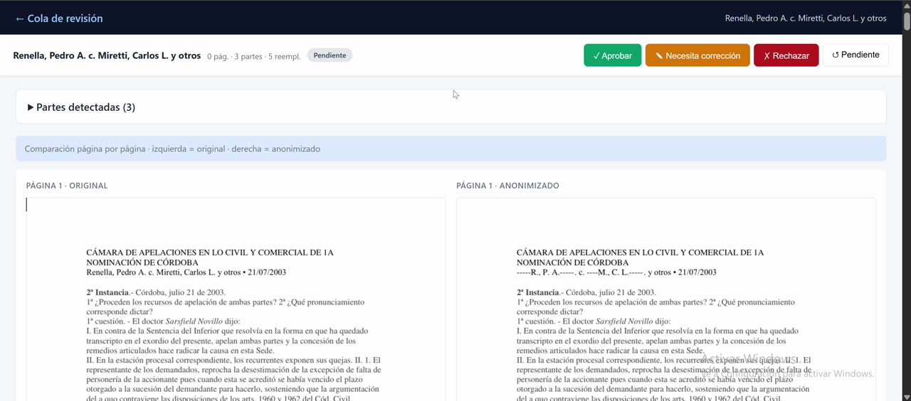

# Anonimizador de Resoluciones Judiciales

Herramienta de anonimización automatizada de resoluciones judiciales argentinas
(`.pdf`, `.docx`). Anonimiza nombres y apellidos de partes (personas físicas) o testigos,
preserva nombres de los roles **públicos** del proceso (jueces, fiscales,
secretarios, letrados, autores citados) y anonimiza los **privados** (partes,
testigos, víctimas, menores). Detecta y anonimiza identificadores: DNI, CUIT, 
CBU, email, teléfono, patentes.

El pipeline está optimizado y validado sobre resoluciones del **Poder Judicial
de Córdoba** y del **Poder Judicial de la Nación**, pero es **flexible**: las
reglas de anonimización pueden adaptarse a otras jurisdicciones, fueros o
incluso dominios no jurídicos modificando el *prompt* del modelo de lenguaje y
los listados de roles.

## Tabla de contenidos

- [Motivación](#motivación)
- [Qué hace el sistema](#qué-hace-el-sistema)
- [Resultados sobre muestras reales](#resultados-sobre-muestras-reales)
- [Instalación](#instalación)
- [Demo](#demo)
- [Uso rápido](#uso-rápido)
  - [CLI — archivo único](#cli--archivo-único)
  - [CLI — carpeta entera (modo lote)](#cli--carpeta-entera-modo-lote)
  - [Dashboard web de revisión](#dashboard-web-de-revisión)
  - [Métricas agregadas](#métricas-agregadas)
  - [Interfaz gráfica (Tkinter)](#interfaz-gráfica-tkinter)
- [Ejemplos incluidos](#ejemplos-incluidos)
- [Flexibilidad: adaptar a otras jurisdicciones](#flexibilidad-adaptar-a-otras-jurisdicciones)
- [Garantías de diseño](#garantías-de-diseño)
- [Limitaciones conocidas](#limitaciones-conocidas)
- [Tests](#tests)
- [Licencia](#licencia)

## Motivación

Publicar jurisprudencia sin datos personales puede ser una tarea útil para
abogados, editores jurídicos y funcionarios judiciales. Hoy se debe hacer manualmente:
leer el fallo, identificar a las partes y/o datos sensibles, y tachar nombre por nombre
o dato por dato en un editor de PDF. En un fallo de 30 páginas con tres actores y dos testigos
puede demorar veinte minutos, con riesgo de saltarse una ocurrencia.

Este proyecto automatiza ese flujo manteniendo el formato visual del PDF
original (texto tachado en negro + marcador de iniciales ocupando el mismo
ancho) y generando un archivo de auditoría que lista qué se anonimizó y por
qué — indispensable para poder revisar y auditar el resultado. También puede procesar archivos
.docx

## Qué hace el sistema

Dado un PDF o DOCX de entrada, el sistema:

1. **Extrae el texto** con preservación de posiciones (coordenadas de cada span
   en el PDF original).
2. **Detecta partes a anonimizar** mediante un modelo de lenguaje local
   (LM Studio, por ejemplo `qwen3.5-9b`) al que se le envía el texto
   completo y un *prompt* que define qué roles incluir/excluir.
3. **Detección por carátula**: un detector basado en "expresiones
   regulares" busca el patrón `APELLIDO, NOMBRE c/ DEMANDADO` en la cabecera
   del documento. Si el modelo no detectó al actor, lo agrega.
4. **Valida contra el texto**: cada nombre devuelto por el modelo se busca
   literalmente en el documento. Los que no aparecen se descartan
   (protección contra alucinaciones).
5. **Expande variantes ortográficas**: cada nombre detectado se busca en
   todas sus formas plausibles — `APELLIDO, NOMBRE`, `NOMBRE APELLIDO`, con y
   sin acentos, con y sin ñ/n (`Rodiño` ↔ `Rodino`), tolerando vocales
   intercambiadas por errores comunes (`Esteban` ↔ `Estaban`), con espacios
   anómalos antes de coma (`Ferrari ,` ↔ `Ferrari,`), y expande nombres
   abreviados (`VÁZQUEZ, ELSA A.` → `Elsa Alicia Vázquez` en el cuerpo).
6. **Detecta identificadores numéricos** con regex verificadas por *checksum*:
   DNI, CUIT (mód-11), CBU (dos bloques BCRA), email, teléfono, patente.
7. **Reemplaza sobre el PDF original** usando PyMuPDF: tacha el rectángulo
   del nombre y escribe el placeholder con iniciales (`R., L. N.` para
   "REINANTE, LAUTARO NEHUEN") relleno con guiones para conservar el ancho.
8. **Escribe un archivo `_audit.json`** con cada parte detectada, su placeholder,
   origen (carátula o modelo) y métricas del procesamiento.
9. **Emite una alerta visible** si el documento tiene texto sustancial pero
   no se detectó ninguna parte, para evitar entregar un PDF sin anonimizar "sin
   que nadie se entere", para que un humano lo "revise" manualmente de manera posterior.

El **modelo de lenguaje no reescribe texto**: sólo devuelve un JSON con los
nombres a anonimizar. La validación fail-closed y la sustitución determinística
garantizan que el PDF final sea predecible y reproducible.

## Resultados sobre muestras reales

Procesado sobre tres tandas de resoluciones reales (públicas) de los fueros
civil/comercial, laboral y penal de la Provincia de Córdoba y Nación:

| Lote | Formato | Documentos | Anonimizados automáticamente | Revisión manual requerida |
|---|---|---|---|---|
| Tanda 1 | PDF | 50 | 44 | 6 |
| Tanda 2 | PDF | 250 | 238 | 12 |
| Tanda 3 | DOCX | 10 | 9 | 1 |

- Tiempo promedio por documento: **0,76 – 4,41 segundos** utilizando una
  Nvidia RTX 3090 con el modelo Qwen3.5-9B.
- La revisión manual requerida **no equivale a error técnico**. Es una señal
  de resguardo del sistema: típicamente aparece cuando no se pudieron
  individualizar partes procesales a anonimizar en un documento con texto
  sustancial, o cuando el caso parece involucrar principalmente personas
  jurídicas u organismos.

## Instalación

Requisitos:

- Python 3.10 o superior
- [LM Studio](https://lmstudio.ai/) corriendo localmente, con un modelo de
  instrucciones cargado (recomendado: `qwen3.5-9b`)
- Git

```bash
git clone <url-del-repo> anonimizador
cd anonimizador

python -m venv .venv
source .venv/bin/activate             # Linux/Mac
.venv\Scripts\activate                # Windows

python -m pip install --upgrade pip
python -m pip install -e .
```

Para instalar también las herramientas de desarrollo y tests:

```bash
python -m pip install -e .[dev]
```

En Windows también podés usar:

```bat
setup_anonimizador.bat
```

Configurar LM Studio:

1. Abrir LM Studio, ir a **Developer** → **Server**.
2. Cargar un modelo (por ejemplo `qwen3.5-9b`).
3. Click en **Start Server** (por defecto en `http://127.0.0.1:1234`).

## Demo

Podés ver una grabación breve del flujo desde GitHub haciendo clic en la
miniatura:

[](./demo.mp4)

En algunos renderizadores de GitHub el video no se embebe directamente dentro
del README. Al hacer clic en la imagen, GitHub abre el archivo `demo.mp4` en
su visor y desde ahí se puede reproducir.

## Uso rápido

### CLI — archivo único

```bash
python -m app --lite ejemplos/entrada/Renella\ Pedro\ A.\ c.\ Miretti\,\ Carlos\ L.\ y\ otros.pdf
```

Genera al lado del archivo:

- `<nombre>_anonimizado.pdf`
- `<nombre>_audit.json` — lista de partes detectadas, reemplazos aplicados,
  tiempo por etapa, alertas.

Para generar una salida más apta para publicación externa:

```bash
python -m app --lite --safe-publish --no-audit /ruta/al/documento.pdf
```

Ese modo:

- usa un nombre de salida neutro (sin reutilizar el nombre original),
- limpia metadatos del PDF,
- ejecuta un post-check simple sobre el documento final,
- y, si detecta una posible fuga, renombra la salida a `*_REVISAR_NO_PUBLICAR.pdf`.

### CLI — carpeta entera (modo lote)

```bash
python -m app --lite /ruta/a/carpeta_con_fallos/
```

Procesa todos los `.pdf` y `.docx` de la carpeta, genera un
`batch_log_AAAAMMDD_HHMMSS.txt` con el resumen por archivo, tiempos, y
cuáles quedaron marcados para revisión manual.

### Dashboard web de revisión

Para validar visualmente los resultados en lotes grandes (QA asistido por humano):

```bash
python -m app review /ruta/a/carpeta_con_fallos/
```

Abre un navegador en `http://127.0.0.1:5555` con:

- Cola filtrable por estado: **Requieren revisión / Todos / Pendientes / Aprobados / Necesitan corrección / Rechazados**.
- Vista por documento: páginas renderizadas **lado a lado** (original vs anonimizado).
- Botones para marcar estado; persistido en `_review_state.json`.
- Panel de ayuda con el flujo de trabajo recomendado.

El filtro "Requieren revisión" prioriza documentos con alertas automáticas o
cero reemplazos. Hay también un modo "Todos" para máxima fiabilidad cuando
se quiere validar manualmente cada documento.

### Métricas agregadas

Para detectar regresiones al correr un lote nuevo:

```bash
python -m app metrics /ruta/a/carpeta_con_fallos/
python -m app metrics /ruta/a/carpeta_con_fallos/ --outliers    # solo casos anómalos
python -m app metrics /ruta/a/carpeta_con_fallos/ --csv stats.csv
```

Reporta: mediana y desvío de reemplazos por mil caracteres, tiempo total,
modelo LLM usado, y marca outliers con *z-score* < –2 (densidad
anormalmente baja que podría indicar sub-anonimización).

### Interfaz gráfica (Tkinter)

```bash
python -m app --gui
```

Para uso interactivo: seleccionar archivo, detectar en modo *dry-run*, revisar
tabla de spans detectados antes de aplicar, y editar la política
`rol → anonimizar` según preferencia.

## Ejemplos incluidos

La carpeta `ejemplos/` contiene ocho resoluciones públicas representativas con
sus anonimizaciones y *audits* generados por el sistema:

| Archivo | Fuero | Caso de interés |
|---|---|---|
| `Renella, Pedro A. c. Miretti, Carlos L. y otros` | Civil/Comercial | Ambas partes persona física, con iniciales |
| `Rehace incidente Minetti, Gladys Aurora...` | Civil — sucesión | Declaratoria de herederos, causantes múltiples, apellido con ñ (Rodiño) |
| `ReyerosRafaelC.c.ProvinciadeCrdoba` | Contencioso administrativo | Persona física vs Estado provincial |
| `REPARTIDORES DE KEROSENE DE YPF C. FRUTACOR` | Comercial | Persona jurídica vs persona jurídica — el sistema deja todo sin anonimizar (política correcta) |
| `ReynaRaquelAidaDelHuerto` | Civil | Contiene el *typo* `Daniel Estaban` (por `Esteban`) que el sistema tolera |
| `Revol - Vocacion hereditaria...` | Civil — sucesorio | Múltiples herederos con apellido común en lista enumerada |
| `REYNA, EMILIA ANGELICA c. CONIFERAL S.A.` | Laboral | Actor persona física vs razón social |
| `REINANTECPLANOVALOS.A.DEAHORROP-` | Consumidor | Expediente largo (162 p.), demandada con nombre corporativo embebido |

Las entradas están en `ejemplos/entrada/` y las salidas en `ejemplos/salida/`.

## Flexibilidad: adaptar a otras jurisdicciones

El comportamiento está concentrado en dos lugares editables:

1. **El prompt del modelo** — en [`app/detect/llm_parties.py`](app/detect/llm_parties.py),
   constante `_SYSTEM_PROMPT`. Controla qué roles se consideran a anonimizar
   (actor, demandado, testigo, víctima, causante, heredero, menor) y cuáles
   se preservan (jueces, letrados, fiscales, peritos oficiales, autores de
   doctrina). Para adaptarlo a un fuero especializado (p.ej. **familia** —
   anonimizar a todos los menores siempre; **penal de menores** — anonimizar
   al imputado) alcanza con editar las listas `INCLUIR` / `NO INCLUIR`.

2. **El detector de carátula** — en
   [`app/detect/caratula_parties.py`](app/detect/caratula_parties.py), la
   expresión `_PARTY_VS`. Hoy tolera las variantes del PJ Córdoba y Nación
   (`c/`, `c.`, `C/`, `contra`, con y sin `s/` al final, en mayúsculas o
   *Title Case*). Para otro tribunal con formato distinto (p.ej. tribunales
   provinciales con separador `vs.`, o carátulas que arrancan con número de
   expediente) se agregan las alternativas al *regex*.

Los filtros de persona jurídica
([`_COMPANY_SUFFIXES_FILTER`](app/detect/llm_parties.py)) también son
editables — por ejemplo para incluir "Fundación", "ONG" u otras formas
societarias locales.

## Garantías de diseño

- **El modelo de lenguaje no puede reescribir el documento**. Sólo devuelve un
  JSON con nombres a anonimizar. El reemplazo físico se hace con
  sustitución determinística.
- **Validación fail-closed contra el texto**. Cualquier nombre devuelto por
  el modelo que no aparezca literalmente en el documento se descarta.
- **Determinismo total**. `temperature=0`, `top_p=1`, `top_k=1` hardcoded.
  Pasar el mismo documento dos veces produce el mismo resultado.
- **Preservación del formato**. El PDF de salida conserva fuentes, márgenes,
  numeración de páginas, cabeceras y encabezados — sólo los rectángulos de
  los nombres cambian.
- **Auditabilidad**. Cada ejecución genera un `_audit.json` con cada parte
  detectada, su origen (modelo o detector de carátula), placeholder asignado,
  y alertas del guardián.
- **Guardián anti-silencio**. Si tras la detección quedan 0 partes en un
  documento con texto significativo (> 500 caracteres), el sistema emite una
  alerta visible y marca el archivo para revisión humana.

## Limitaciones conocidas

- **Dependencia del modelo de lenguaje local**. La calidad del detector
  depende del modelo cargado en LM Studio. Modelos muy pequeños (< 3 B
  parámetros) pierden recall. Modelos *reasoning* (qwen3-r1, deepseek-r1)
  gastan tokens en el razonamiento interno; si se usan, subir `max_tokens`
  a 16 384 o más.

- **Documentos escaneados sin OCR**. El sistema extrae texto con PyMuPDF; si
  el PDF es imagen pura (fotocopia sin capa de texto) no detecta nada. Usar
  OCR previo (Adobe Acrobat, Tesseract) antes de procesar.

- **Carátulas truncadas o atípicas**. Si el PDF no empieza con la forma
  `APELLIDO, NOMBRE c/ ...` y el modelo tampoco detecta a las partes,
  el documento se marca con alerta pero sale sin anonimizar. Casos típicos:
  copias parciales de resoluciones, transcripciones de audiencias, artículos
  de doctrina. El dashboard muestra estas alertas al tope para revisión
  manual.

- **Personas mencionadas una sola vez**. Cuando un nombre aparece exactamente
  una vez en todo el documento (p. ej. un heredero nombrado sólo en la
  carátula), el modelo a veces no lo incluye porque no tiene suficiente
  contexto. La red de seguridad por carátula mitiga esto pero no lo elimina.

- **Typos de consonantes**. La tolerancia a *typos* cubre vocales intercambiadas
  (`Esteban` ↔ `Estaban`) pero no consonantes (`David` ↔ `Dadid`) para
  evitar falsos positivos.

## Tests

```bash
python -m pytest -q
```

La suite está pensada para ser independiente del modelo LLM en ejecución
(cliente mockeado), aunque algunos tests requieren tener instaladas las
dependencias opcionales de desarrollo con `pip install -e .[dev]`.

## Licencia

Este repositorio se distribuye bajo la licencia
[`PolyForm Noncommercial 1.0.0`](LICENSE).

Eso significa, en términos prácticos, que el código puede consultarse,
estudiarse, ejecutarse y modificarse para fines no comerciales, pero **no**
puede utilizarse comercialmente sin una autorización o licencia separada del
titular del copyright.
